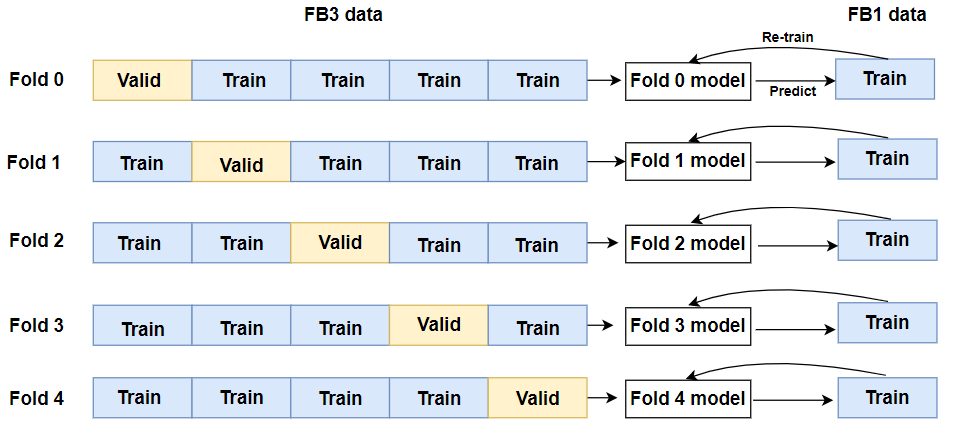
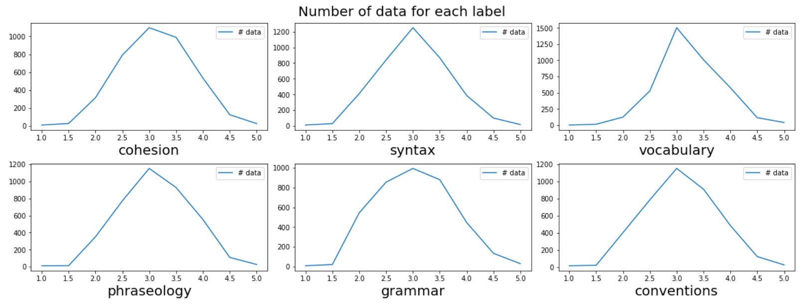

# Feedback Prize 3 Competition

This is a repository that summarizes the methods I used in the **[Feedback Prize - English Language Learning](https://www.kaggle.com/c/feedback-prize-english-language-learning).** It is a task that evaluates the score of each essay by the six analytic measure: cohesion, syntax, vocabulary, phraseology, grammar, and conventions.

### Goal of the Competition

The goal of this competition is to assess the language proficiency of 8th-12th grade English Language Learners (ELLs). Utilizing a dataset of essays written by ELLs will help to develop proficiency models that better supports all students.

### Dataset Description

The dataset presented here (the ELLIPSE corpus) comprises argumentative essays written by 8th-12th grade English Language Learners (ELLs). The essays have been scored according to six analytic measures: cohesion, syntax, vocabulary, phraseology, grammar, and conventions.

Each measure represents a component of proficiency in essay writing, with greater scores corresponding to greater proficiency in that measure. The scores range from 1.0 to 5.0 in increments of 0.5. Your task is to predict the score of each of the six measures for the essays given in the test set.

## Method Overview

Like most top solutions, the main method that worked are layer-wise learning rate decay, re-initializing the last two layers, and pseudo-labeling.

My solution is the ensemble of 8 models

|       model |     changed |            CV | Source |
| --- | --- | --- | --- |
| deberta-v3-base | LLRD + re-init + max_token_length = 1428 | 0.4547 | Ours |
| deberta-v3-base | LLRD + re-init + max_token_length = 768 | 0.4543 | Ours |
| deberta-v3-base | LLRD + re-init + max_token_length = 1428 + pseudo labeling | 0.4544 | Ours |
| deberta-v3-large | LLRD + re-init | 0.4553 | FB3 Deberta Family Inference |
| deberta-v3-large | different seed | 0.4548 | FB3 Deberta Family Inference |
| deberta-v3-large | different seed | 0.4569 | FB3 Deberta Family Inference |
| deberta-v2-xlarge | LLRD + re-init | 0.4604 | FB3 Deberta Family Inference |
| deberta-v2-xlarge-mnli | LLRD + re-init | 0.4675 | FB3 Deberta Family Inference |

deberta-v3-large and xlarge models were brought from [FB3 Deberta Family Inference](https://www.kaggle.com/code/kojimar/fb3-deberta-family-inference-9-28-updated)

## Final Result

**587 / 2654 (Top 23%)** [link](https://www.kaggle.com/ju7on9/competitions?tab=completed)

## What worked

### 1. **Layer-wise learning rate decay (LLRD)**

The bottom layer of a transformer encodes more general information, while the top layer encodes information specific to a pre-trained task. If the bottom layer has higher learning rate, it is likely to lose general information. Likewise, if the top layer has lower learning rate, the parameters tend to fix to the pre-trained task, not fine-tuning task. Therefore, layer-wise learning rate decay that sets higher LR to the top layer, and lower LR to the bottom layer, can make the model become specific to the fine-tuning task while maintaining general information.

|  |     CV |   Public |  private |
| --- | --- | --- | --- |
| Baseline | 0.4557 | 0.443399 | 0.4423 |
| Baseline + LLRD | 0.4547 | 0.44323 | 0.441697 |

### 2. **Re-initializing the last layer**

As the pre-trained top layer specializes to the pre-trained tasks, using the entire pre-trained layers for a fine-tuning task slows down training and hurts performance. Through re-initializing the last layer, the model can forget information specific to the pre-training task, and increase performance to the fine-tuning task. However, it decreases only CV and LB, not private score.

|  |     CV |   Public |  private |
| --- | --- | --- | --- |
| Baseline + LLRD | 0.4547 | 0.44323 | 0.441697 |
| Baseline + LLRD + Re-init | 0.4547 | 0.440144 | 0.442562 |

### 3. **Pseudo Labeling**

As this is the third Feedback competition (FB3), there are other kinds of Feedback competition data ([FB1](https://www.kaggle.com/competitions/feedback-prize-2021) and [FB2](https://www.kaggle.com/competitions/feedback-prize-effectiveness)). The distribution of FB2 data is quite different from that of FB3 data, I selected FB1 data for pseudo labeling. 

The process of pseudo labeling is as follows

#### **A. Generate Pseudo Labels**

**(1)** The format of FB1 is transformed into that of FB3

**(2)** The FB3 data was split by 5 folds with [`MultilabelStratifiedKFold`](https://github.com/trent-b/iterative-stratification#multilabelstratifiedkfold) , and the 5 models were trained with each set of the folds. (The training data of 0-fold model are 1~4 folds, and validation data is 0 fold)

**(3)** Each model predicts FB1 data, resulting in five pseudo labeling data.

**(4)** FB3 data is appended to FB1 pseudo labeling data, resulting in the five set of data. (0-fold pseudo data includes 1~4 folds of FB3 data and FB1 data predicted by 0-fold model.)

#### **B. Train the models with pseudo data**

 At this stage, I trained the models with two different strategies with pseudo data.

 **(5-1)** Train new models from scratch with pseudo data

 **(5-2)** The model created in the process of generating the pseudo label was re-learned using the pseudo label.
    (ex. 0-fold model is trained with FB1 data predicted by 0-fold model)

**(5-2)** approach increases CV a lot, so I didn’t submit **(5-2)** model. (Lower is better for CV and LB)

**(5-1)** approach decreases CV a little, so I submit the **(5-1)** model, resulting in decreasing LB.

|  |     CV |   Public |  private |
| --- | --- | --- | --- |
| Baseline (LLRD + re-init) | 0.4547 | 0.440144 | 0.442562 |
| Baseline + Pseudo Labeling | 0.4544 | 0.439471 | 0.442218 |

## What didn’t worked

### 1. **Augmentations**

Due to the lack of the labels 1.0, 1.5, 4.5, and 5.0, I was trying to increase the number of labels using [nlpaug](https://github.com/makcedward/nlpaug). I used [ContextualWordEmbsAug](https://nlpaug.readthedocs.io/en/latest/augmenter/word/context_word_embs.html) with bert-base to replace some part of words in the sentence by new words. 

However, it increased CV (+0.1~0.2) because replacing the word affects ‘cohesion’, ‘syntax’, ‘grammar’ and ‘convention’ included in the labels, resulting in inconsistency between the original labels and the augmented texts. Therefore, I did not apply the augmentation to the final model.

### 2. **Weighted Loss**

The above figures are distributions of ground truth labels and predictions of the baseline for 1.0 score examples of each category. As shown in the figure above, the prediction of the baseline for 1.0, 1.5, 4.5, and 5.0 tends to be biased to 3.0. In order for the model to well predict the corresponding labels, I used weighted loss function for the corresponding labels (twice for 1.0, 1.5, 4.5 and 5.0) during the training. And I trained the model in several different ways.

**(1)** After training the model with the original loss function during 5 epochs, the weighted loss is used during the next 5 epochs.

**(2)** After training the model with the weighted loss during 5 epochs, the original loss is used during the next 5 epochs.

**(3)** Only used weighted loss for 5 epochs

However, all the above method didn’t work. They increased CV (+0.2~0.3), so I didn’t adopt weighted loss.

### 3. **Fast Gradient Method, Dropout**

| Baseline | avg_train_loss | avg_val_loss |
| --- | --- | --- |
| fold 0 | 0.0818 | 0.1020 |
| fold 1 | 0.0837 | 0.1035 |
| fold 2 | 0.0830 | 0.1052 |
| fold 3 | 0.0834 | 0.1033 |
| fold 4 | 0.0810 | 0.1020 |

As shown in the figure above, the train loss is around 0.01~0.02 for each epoch, but the validation loss is about 0.1. It implies that the model overfits to the training data. In order to reduce overfitting, I tried some regularization methods such as dropout and adversarial training, but they didn’t work.

## Important Citations

[https://www.kaggle.com/code/rhtsingh/on-stability-of-few-sample-transformer-fine-tuning/notebook](https://www.kaggle.com/code/rhtsingh/on-stability-of-few-sample-transformer-fine-tuning/notebook)

[https://www.kaggle.com/code/yasufuminakama/fb3-deberta-v3-base-baseline-train](https://www.kaggle.com/code/yasufuminakama/fb3-deberta-v3-base-baseline-train)

[https://www.kaggle.com/code/kojimar/fb3-single-pytorch-model-train](https://www.kaggle.com/code/kojimar/fb3-single-pytorch-model-train)
